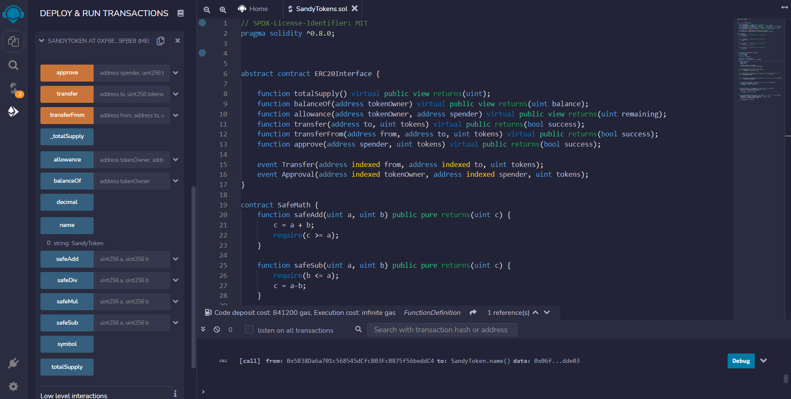
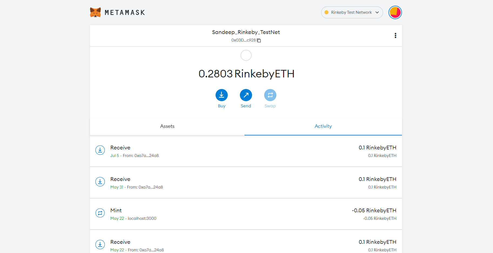

# SandyCoin_ownCryptocurrency
Created own Cryptocurrency (named it SandyCoin) and deployed it in Rinkeby TestNet.

This is how the Output terminal will look like --->

Once you deploy your Smart Contract go to Environment and Inject Web3 ---> MetaMask will pop up for payment !

On Deploying, This is how the code will run, Metamask will open and once you complete the transaction the output terminal showing the emitted details stored in Blockchain...

https://user-images.githubusercontent.com/49147378/177360720-affc544a-1986-4ed6-8101-702260294be3.mp4

To confirm the transaction, one can visit Rinkeby Etherscan to check the details as shown...

https://user-images.githubusercontent.com/49147378/177361456-f5a18c88-847d-4efa-8bc1-da69f6898688.mp4

Hope you understand the Context...for any doubts you can reach out to me at sandeepiit.ism@gmail.com
